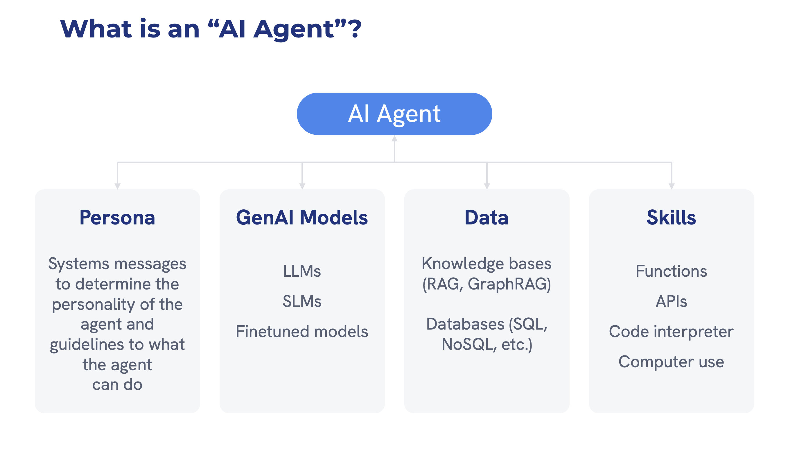
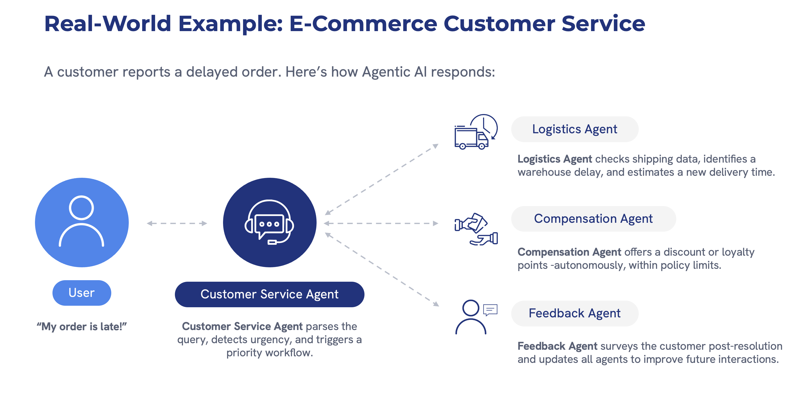

# Introduction to AI Agents

Welcome to Challenge 1 of the AI Agents Hackathon! In this challenge, we'll explore the fundamentals of AI agents - what they are, their key components, and how they're transforming the world of AI.

## What is an AI Agent?

An AI agent is an autonomous system that uses artificial intelligence to perceive its environment, make decisions, and take actions to achieve specific goals. Think of an AI agent as a digital assistant that can act on its own to complete tasks, rather than just responding to direct commands.

To understand this better, consider the difference between:
- A traditional calculator app (not an agent): It gives you answers only when you input a math problem.
- A personal finance AI agent: It proactively monitors your spending, suggests budget adjustments, and might even automatically categorize transactions without being asked.

Unlike traditional AI systems that simply process inputs and generate outputs, AI agents can operate independently, learn from experiences, and adapt to changing conditions. They're designed to be helpful, autonomous assistants that can take initiative and solve problems within their defined scope.

### Key Characteristics of AI Agents

- **Autonomy**: Operates without constant human intervention, making decisions and taking actions based on its programming and learned experiences. For example, an email AI agent might automatically sort and prioritize messages without being told to do so each time.

- **Perception**: Uses various inputs (such as text, images, data feeds, or sensors) to understand and interpret its environment. This is like how a self-driving car uses cameras and sensors to "see" the road and other vehicles.

- **Reasoning**: Applies logic, pattern recognition, and decision-making processes to analyze situations. For instance, a healthcare AI agent might examine patient symptoms, medical history, and treatment options before suggesting potential diagnoses.

- **Action**: Takes specific actions to achieve goals based on its reasoning. This could range from sending a notification, scheduling an appointment, making a purchase, or controlling physical devices.

- **Learning**: Improves performance over time by learning from past experiences, much like how humans learn from trial and error. An AI customer service agent might get better at addressing common complaints by analyzing thousands of previous interactions.

- **Adaptability**: Adjusts behavior in response to new information or changing environments. For example, a smart home AI agent might change heating patterns based on your changing schedule or seasonal weather shifts.

## Core Components of an AI Agent

#### AI agents consist of several key components that work together, similar to how different parts of your brain and body collaborate to help you function.

 Let's break down these components:

### 1. Persona
The persona is essentially the "character" and ruleset of the agent - it defines how the agent presents itself and operates.

- **System Messages**: These are special instructions that define the personality, tone, and behavior guidelines of the agent. They're like the "constitution" that governs how an agent should behave. For example, a customer service agent might have system messages instructing it to be polite, empathetic, and solution-oriented.

- **Agent Identity**: This is the character and role the agent embodies - whether it's a helpful travel planner, a knowledgeable tutor, or an efficient personal assistant. The identity shapes how the agent communicates and what tasks it's designed to handle.

- **Operating Guidelines**: These are specific rules that determine what the agent can and cannot do - its permissions and limitations. For instance, an agent might be allowed to access your calendar but not your banking information.

### 2. GenAI Models
These are the "brains" of the AI agent - the underlying technology that enables understanding and generating human-like responses.

- **Large Language Models (LLMs)**: Foundation models like GPT-4, Mistral, or Llama that provide reasoning capabilities. These massive AI models have been trained on billions of text examples and can understand and generate human language. They're like the general knowledge and reasoning center of the agent.

- **Small Language Models (SLMs)**: More focused, efficient models designed for specific tasks. While not as broadly capable as LLMs, they're faster and more resource-efficient for specialized functions, like a calculator that's excellent at math but doesn't need to write poetry.

- **Finetuned Models**: These are models that have been further trained for particular domains or applications. Just as a doctor specializes in a specific field of medicine, a medical AI agent might use a model fine-tuned on medical literature to provide more accurate healthcare information.

### 3. Data
Data represents the information resources available to the agent - what it "knows" or can access.

- **Knowledge Bases**: Structured information the agent can access and use to answer questions or make decisions. This is like having an encyclopedia that the agent can reference. For example, a technical support agent might have access to a knowledge base of product specifications and common troubleshooting steps.

- **RAG/GraphRAG**: Retrieval Augmented Generation (RAG) systems help the agent find relevant information from large datasets when needed. Instead of the agent having to memorize everything, it can look up information on demand - similar to how you might search the internet rather than memorizing all facts. GraphRAG adds relationship connections between pieces of information for more contextual understanding.

- **Databases**: SQL, NoSQL, and other data storage systems the agent can query to retrieve or store information. These might contain user preferences, historical interactions, or other structured data the agent needs to perform its tasks effectively.

### 4. Skills
Skills are the specific capabilities and actions an agent can perform - what it can "do".

- **Functions**: Specific operations the agent can execute, such as calculating a tip, converting currency, or generating a summary. These are like the specialized skills a human might learn.

- **APIs**: Application Programming Interfaces allow the agent to interact with external services and systems. These are like doorways to other digital services - for example, an agent might use a weather API to check the forecast or a mapping API to provide directions.

- **Code Interpreter**: The ability to write, understand, and execute code gives agents powerful computational capabilities. This is like having a programmer at your disposal who can create custom solutions for data analysis, visualization, or automation.

- **Computer Use**: Capability to interact with computer systems, applications, and files. This allows agents to perform tasks like searching for files, opening applications, or managing system settings on behalf of users.

## How AI Agents Differ from Traditional AI

To better understand what makes AI agents special, let's contrast them with traditional AI systems:

| Traditional AI Systems | AI Agents |
|------------------------|-----------|
| Respond only to direct inputs | Can initiate actions autonomously |
| Handle single, specific tasks | Can manage complex workflows across multiple domains |
| Require explicit instructions | Can interpret goals and determine how to achieve them |
| Static capabilities | Learn and improve over time |
| Operate independently of other systems | Can collaborate with other agents and systems |
| Focus on immediate responses | Can plan and work toward longer-term objectives |

## Use Cases for AI Agents

AI agents are being deployed across numerous domains, revolutionizing how work gets done and services are delivered.

Let's look at a real-world example of an AI agent in action:

### Real-World Example: E-Commerce Customer Service

Let's examine how AI agents work together in a practical e-commerce scenario:

When a customer reports a delayed order, a coordinated system of AI agents springs into action:

1. **Customer Service Agent**: The primary agent receives the customer's concern about a late order. This agent serves as the main point of contact, maintaining a consistent conversation with the customer while orchestrating the response behind the scenes.

2. **Logistics Agent**: This specialized agent checks shipping data, identifies the package's current location, and calculates a new delivery time estimate. It has deep integration with tracking systems and delivery networks.

3. **Compensation Agent**: Based on company policy and the severity of the delay, this agent automatically determines appropriate compensation, such as a discount code or loyalty points addition.

4. **Feedback Agent**: This agent records the customer interaction, analyzes the resolution process, and adapts the system to improve future customer service experiences.

This multi-agent approach allows for a comprehensive solution that would be difficult for a single agent to provide. Each agent contributes its specialized capabilities while appearing to the customer as a seamless, unified support experience.

The key benefits of this approach include:
- Specialized expertise from each agent
- Parallel processing of different aspects of the problem
- Consistent communication through the customer-facing agent
- Continuous improvement through the feedback loop

This example demonstrates how AI agents can collaborate to solve complex problems while providing efficient, personalized customer service.

### Diverse Applications of AI Agents Across Industries

AI agents are transforming operations across multiple sectors, providing intelligent automation and assistance in various contexts. Here are some notable implementations:

- **Enterprise Productivity**: Automating routine tasks, managing schedules, and summarizing information.
  * Example: A meeting assistant agent that joins video calls, takes notes, identifies action items, and automatically creates and assigns tasks in project management software.
  * Example: An email management agent that drafts responses to routine inquiries, categorizes messages by urgency, and follows up on unanswered communications.

- **Customer Service**: Handling inquiries, processing requests, and providing 24/7 support.
  * Example: A retail support agent that can answer product questions, process returns, track orders, and escalate complex issues to human representatives when needed.
  * Example: A banking agent that helps customers check balances, transfer funds, dispute charges, and find suitable financial products.

- **Healthcare**: Assisting with diagnoses, monitoring patient data, and providing medical information.
  * Example: A patient monitoring agent that tracks vital signs from wearable devices, alerts healthcare providers to concerning changes, and reminds patients to take medications.
  * Example: A medical research assistant that helps doctors find relevant studies, treatment guidelines, and potential drug interactions for complex cases.

- **Finance**: Analyzing market trends, managing portfolios, and detecting fraudulent activities.
  * Example: An investment advisor agent that monitors market conditions, rebalances portfolios based on goals and risk tolerance, and notifies users of significant market events.
  * Example: A fraud detection agent that monitors transactions in real-time, identifies suspicious patterns, and either blocks potentially fraudulent activities or verifies them with the account holder.

- **Education**: Tutoring students, providing feedback, and creating personalized learning experiences.
  * Example: A personal tutor agent that adapts to a student's learning style, explains concepts in multiple ways, identifies knowledge gaps, and creates customized practice exercises.
  * Example: A research assistant agent that helps students find relevant sources, check citations, organize notes, and develop outlines for papers.

- **Research & Development**: Analyzing data, generating hypotheses, and suggesting experimental designs.
  * Example: A scientific research agent that can analyze complex datasets, identify potential correlations, suggest additional experiments, and help draft research papers.
  * Example: A product development agent that gathers competitive intelligence, analyzes customer feedback, and suggests feature improvements based on market trends.

## The Future of AI Agents

As AI technology advances, agents will become increasingly sophisticated, capable of handling more complex tasks and exhibiting greater autonomy. Future developments will likely include:

- **Enhanced reasoning capabilities**: Agents will develop more sophisticated reasoning, allowing them to handle nuanced scenarios, ethical dilemmas, and complex decision-making. For example, a future legal assistant agent might analyze precedent cases, identify relevant statutes, and construct sound legal arguments.

- **Better collaboration between agents**: Multi-agent systems will become more seamless, with specialized agents working together like expert teams. Imagine a home management system where separate agents handling security, energy efficiency, entertainment, and maintenance coordinate their actions for optimal results.

- **More natural human-agent interaction**: Interaction with agents will become more conversational, intuitive, and multimodal (combining text, voice, images, and video). Rather than using specific commands, you might simply have natural conversations with agents that understand context, emotions, and non-verbal cues.

- **Specialized agents for specific domains**: As the technology matures, we'll see more highly specialized agents with deep expertise in particular fields, similar to human specialists. These might include agents specializing in areas like architectural design, scientific research, or creative writing.

- **Integrated agent ecosystems**: Agents will increasingly work together in ecosystems that combine their capabilities for more comprehensive solutions. For example, your personal finance agent might collaborate with your calendar agent to schedule bill payments around your paydays, while your shopping agent ensures you're getting the best deals.

## Conclusion

Understanding AI agents is the first step in leveraging their potential. These autonomous AI systems represent a significant advancement beyond traditional AI tools, offering proactive assistance, continuous learning, and the ability to handle complex, multi-step tasks with minimal human oversight.

In the upcoming challenges, we'll explore how to build, customize, and deploy AI agents using various frameworks and tools. You'll learn to create agents with specific personas, connect them to useful data sources, equip them with powerful skills, and design them to effectively solve real-world problems.

By the end of this hackathon, you'll have the knowledge and practical experience to develop AI agents that can transform how you work, create, and solve problems in your personal and professional life.

Ready to move on? [Proceed to Challenge 2](../challenge-2/README.md) to start exploring agentic AI frameworks! 